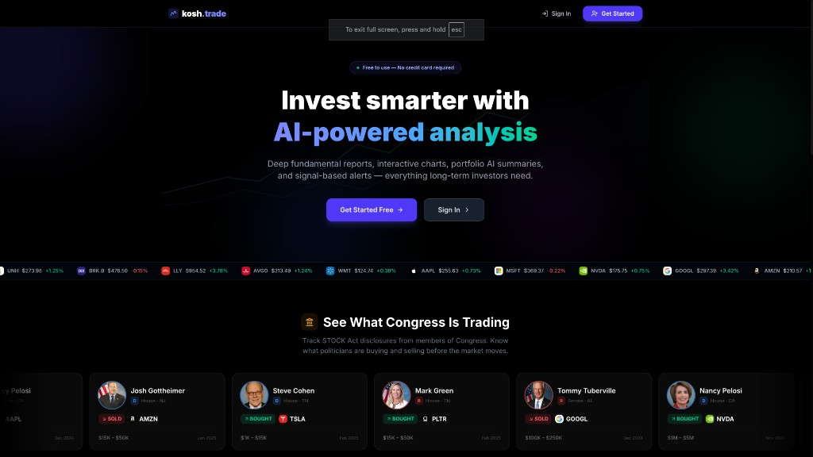

# Kosh

A self-hosted trading intelligence platform that scans markets, scores stocks across 7 dimensions, and surfaces the highest-conviction opportunities — then executes trades autonomously.

Built with Next.js, PostgreSQL, and deployed on a Raspberry Pi.

**Live at [kosh.trade](https://kosh.trade)**

---

## Screenshots

### Landing
<p align="center">
  
</p>

### Dashboard
<p align="center">
  
</p>

### KoshPilot — Autonomous Trading
<p align="center">
  
</p>

### Signal Intelligence
<p align="center">
  
</p>

---

## The Algorithm

Every feature on Kosh is powered by the same multi-layered conviction engine. Whether it's picking the Top 10 stocks, deciding what KoshPilot should buy, or ranking signals — the same pipeline runs underneath.

### Pipeline Overview

```
  12+ Data Sources        Quality Gate         7-Dimension Scoring
 ┌──────────────┐      ┌──────────────┐      ┌──────────────────────┐
 │ Insider Buys │      │ Market Cap   │      │ 1. Signal Diversity  │
 │ Congress     │      │ > $500M      │      │ 2. Technical         │
 │ Earnings     │ ──►  │ Volume       │ ──►  │ 3. Fundamental       │
 │ Analyst Grds │      │ > 500K/day   │      │ 4. Valuation         │
 │ News / M&A   │      │ Price > $5   │      │ 5. Smart Money       │
 │ Screener     │      │ Revenue > 0  │      │ 6. Catalyst+AI Sent. │
 │ SEC Filings  │      │ Debt/Eq < 3  │      │ 7. Risk-Adjusted     │
 └──────────────┘      └──────────────┘      └──────────┬───────────┘
                                                        │
                                                        ▼
                                            ┌───────────────────────┐
                                            │  Composite Score      │
                                            │  (weighted blend)     │
                                            │                       │
                                            │  Sector Diversify     │
                                            │  (max 3 per sector)   │
                                            │                       │
                                            │  Blended Target Price │
                                            │  DCF + Analyst + Tech │
                                            │                       │
                                            │  AI Thesis Generation │
                                            │  (Claude)             │
                                            └───────────────────────┘
```

### Layer 1 — Signal Discovery

Scans 12+ real-time data sources every cycle:

| Source | What it captures |
|--------|-----------------|
| Insider Trading | Officers/directors buying their own stock |
| Congressional Trades | Senate and House member purchases |
| Analyst Grades | Upgrades, downgrades, re-ratings |
| Earnings Calendar | Upcoming and recent earnings surprises |
| Market Screener | Gainers, volume spikes, momentum leaders |
| News & Press Releases | Breaking news and corporate announcements |
| M&A Activity | Mergers, acquisitions, tender offers |
| SEC 8-K Filings | Material events filed with the SEC |
| Institutional Ownership | Large fund position changes |
| Sector Performance | Rotating sector strength/weakness |

All tickers from these sources are pooled into a candidate set (~60-80 stocks per cycle).

### Layer 2 — Quality Gate

Filters out noise before any scoring happens. A stock must pass all checks:

- **Market Cap** > $500M (no micro-caps)
- **Average Volume** > 500K shares/day (must be liquid)
- **Price** > $5 (no penny stocks)
- **Revenue** > $0 (must have real revenue, when data is available)
- **Debt/Equity** < 3x (no over-leveraged companies, when data is available)

Typically 40-60% of candidates pass this gate.

### Layer 3 — 7-Dimension Scoring

Each surviving stock is scored 0-100 across seven dimensions, then blended with equal-ish weights:

| Dimension | Weight | What it measures |
|-----------|--------|-----------------|
| **Signal Diversity** | 15% | How many independent sources flagged this stock (insider + congress + analyst + news = stronger than just one) |
| **Technical** | 15% | RSI, MACD, Bollinger Bands, Stochastic, ADX trend strength, VWAP, volume spikes, support/resistance |
| **Fundamental** | 15% | Revenue growth, gross/operating margins, ROE, current ratio, FCF yield, earnings surprise history |
| **Valuation** | 15% | Forward P/E, PEG ratio, EV/EBITDA, DCF discount to intrinsic value, price-to-FCF |
| **Smart Money** | 15% | Insider cluster buying (recency-weighted), congressional purchase patterns, institutional activity, analyst upgrade momentum |
| **Catalyst + AI Sentiment** | 15% | Upcoming catalysts (earnings, M&A, FDA) + Claude AI sentiment analysis of recent news headlines (-100 to +100) |
| **Risk-Adjusted** | 10% | Expected upside vs ATR-based downside, Sharpe-like ratio, beta, max drawdown over 3 months |

### Layer 4 — Sector Diversification

Caps at **3 stocks per sector** to avoid concentration risk. If Technology has 5 candidates in the top 10, only the 3 highest-scoring make it.

### Layer 5 — Enrichment

For the final picks:

- **Blended Target Price** — Weighted average of DCF intrinsic value (35%), analyst consensus target (40%), and technical target (25%)
- **Hold Period** — Determined by ATR% and Beta: low volatility → LONG (6-12mo), moderate → MEDIUM (1-3mo), high → SHORT (1-4wk)
- **AI Thesis** — Claude generates a structured investment thesis: bull case, key evidence, primary risk, and catalyst timeline
- **Confidence Band** — Composite score maps to VERY HIGH (45+), HIGH (25-44), or MODERATE (<25)
- **Kosh Confidence Score** — Weight-adjusted coverage metric: which of the 7 dimensions had real data vs gaps

### Kosh Confidence Score

Each pick carries a **Kosh Confidence Score (0-100%)** — distinct from the conviction score. It measures how much underlying data was available to score the pick:

- If all 7 dimensions returned real data → **100%** confidence
- If valuation and smart money had no data (API gaps) → confidence drops proportionally by weight
- Prevents users from treating a "high conviction on thin data" pick the same as one backed by full coverage

The score is weight-aware: dimensions with higher algorithmic weight (fundamental, valuation) impact confidence more than lighter ones (risk-adjusted).

### Performance & Outcome Tracking

Every pick is tracked daily against its entry price:

- **Current return** — live P&L since pick date
- **Peak return** — maximum gain reached (the "perfect profit")
- **Target hit** — whether the blended target price was reached
- **Timeline accuracy** — did it hit target within the predicted hold period (+60 day grace)

Outcomes are classified automatically:

| Outcome | Meaning |
|---------|---------|
| **BULLSEYE** | Hit target within predicted timeline |
| **LATE_HIT** | Hit target but after the predicted window |
| **WINNER** | Positive return but didn't reach full target |
| **MISS** | Negative return or flat after hold period |
| **TRACKING** | Still within hold period, not yet classified |

### Algorithm Performance Dashboard

Aggregate stats across all historical picks:

- **Win Rate** — % of picks with positive return
- **Target Hit Rate** — % of picks that reached their blended target price
- **Timeline Accuracy** — % of target hits that occurred within the predicted window
- **Average Return / Peak Return** — mean performance across all tracked picks
- **Outcome Breakdown** — visual distribution of BULLSEYE / LATE_HIT / WINNER / MISS
- **Notable Calls** — top picks that hit their targets with the highest returns
- **Notable Misses** — worst misses for transparency and algorithm improvement

---

## Features

### Top 10 High-Conviction Picks ⭐

The flagship feature. Runs the full conviction pipeline and surfaces the 10 best opportunities in the market right now.

Each pick includes:
- **Conviction Score** — composite score from the 7-dimension scoring engine
- **Kosh Confidence Score** — transparency metric showing data completeness (0-100%)
- **Target Price** — blended from DCF, analyst consensus, and technical targets
- **Hold Period** — volatility-driven (SHORT 1-4wk / MEDIUM 1-3mo / LONG 3-12mo)
- **AI Thesis** — Claude-generated investment case with bull case, evidence, risk, and timeline

Three views:
1. **Current Picks** — today's top 10 with live price tracking
2. **Track Record** — historical batches with outcome badges (BULLSEYE, WINNER, MISS)
3. **Algorithm Performance** — aggregate stats, win rate, target hit rate, notable calls and misses

**Algorithm:** [The Algorithm →](#the-algorithm)

### KoshPilot — Autonomous Trading

Fully autonomous trading engine that runs on a cron schedule (Raspberry Pi). Discovers what to trade from live signals — not from a fixed watchlist.

- Signal-first market scanning using the same discovery pipeline
- Risk-managed execution with three profiles: Conservative, Moderate, Aggressive
- Position sizing based on conviction score and risk profile
- Stop-losses, take-profit targets, and trailing stops
- Live equity curve with real-time P&L tracking
- Autopilot health monitoring — cron status, last run, signals scanned
- Prediction accuracy analytics (win rate, avg return, best/worst picks by strategy)

**Algorithm:** [The Algorithm →](#the-algorithm)

### Signals & Research

Market-wide signal intelligence with AI-powered narrative synthesis.

- Aggregates 12+ data sources into a unified signal feed
- Claude AI generates market narratives from raw signals
- Best-buy recommendations across investment horizons
- Stock deep-dive with technicals, fundamentals, earnings, insider activity
- Congressional trade tracking (Senate + House)
- Each signal is scored using the same conviction dimensions

**Algorithm:** [The Algorithm →](#the-algorithm)

### Dip Finder

Scans for oversold stocks that are showing reversal signals.

- RSI, Bollinger Band, and VWAP-based oversold detection
- Volume spike confirmation on bounce candidates
- Cross-references with insider buying activity during dips
- Filters through the quality gate to avoid value traps

**Algorithm:** [The Algorithm →](#the-algorithm)

### Portfolio Management

- Multi-portfolio tracking with holdings and performance
- AI-generated portfolio summaries and risk assessment
- Price alerts and notifications

### Admin Panel

Platform administration with user management and analytics.

- User tier management (Pro/Free) with one-click toggle
- Feature gate controls for Pro features
- Detailed usage analytics: logins, feature access, time spent
- Activity feed with real-time platform event monitoring

---

## Architecture

```
┌─────────────────────────────────────────────────────────────────────┐
│                          kosh.trade (UI)                            │
│                                                                     │
│  ┌───────────┐ ┌───────────┐ ┌───────────┐ ┌───────────────────┐   │
│  │ Top Picks │ │  Signals  │ │ Portfolio │ │    KoshPilot      │   │
│  │           │ │           │ │           │ │  (Auto-Trading)   │   │
│  └─────┬─────┘ └─────┬─────┘ └─────┬─────┘ └────────┬──────────┘   │
│        └──────────────┴─────────────┴────────────────┘              │
│                               │                                     │
├───────────────────────────────┼─────────────────────────────────────┤
│                        API Layer (Next.js)                          │
│                               │                                     │
│   ┌───────────────────────────┼───────────────────────────────┐     │
│   │              Conviction Engine (shared)                   │     │
│   │                           │                               │     │
│   │  ┌─────────────┐  ┌──────┴──────┐  ┌──────────────────┐  │     │
│   │  │  Signal      │  │  7-Dim      │  │  Technical       │  │     │
│   │  │  Discovery   │  │  Scorer     │  │  Scanner         │  │     │
│   │  └──────┬───────┘  └──────┬──────┘  └────────┬─────────┘  │     │
│   │         │                 │                   │            │     │
│   │  ┌──────┴───────┐  ┌─────┴───────┐  ┌───────┴────────┐   │     │
│   │  │  AI Analyst  │  │  Risk Mgmt  │  │  Quality Gate  │   │     │
│   │  │  (Claude)    │  │  & Sizing   │  │  & Fundamentals│   │     │
│   │  └──────────────┘  └─────────────┘  └────────────────┘   │     │
│   │                                                           │     │
│   └───────────────────────────────────────────────────────────┘     │
│                               │                                     │
├───────────────────────────────┼─────────────────────────────────────┤
│                        Data Sources                                 │
│                               │                                     │
│   ┌──────────────┐  ┌──────────┐  │  ┌──────────────┐             │
│   │ FMP Stable   │  │  Yahoo   │  │  │  Claude AI   │             │
│   │  (20+ endpts)│  │ Finance  │  │  │  (Anthropic) │             │
│   └──────────────┘  └──────────┘  │  └──────────────┘             │
│                               │                                     │
└───────────────────────────────┼─────────────────────────────────────┘
                                │
                    ┌───────────┴───────────┐
                    │   Raspberry Pi        │
                    │                       │
                    │  ┌─────────────────┐  │
                    │  │  PostgreSQL     │  │
                    │  │  (Prisma ORM)   │  │
                    │  └─────────────────┘  │
                    │  ┌─────────────────┐  │
                    │  │  PM2 + Cron     │  │
                    │  │  (Auto Cycles)  │  │
                    │  └─────────────────┘  │
                    └───────────────────────┘
```

## Tech Stack

| Layer | Tech |
|-------|------|
| Frontend | Next.js 16, React 19, Tailwind CSS, Recharts |
| Backend | Next.js API Routes, TypeScript |
| Database | PostgreSQL, Prisma ORM |
| AI | Claude (Anthropic SDK) |
| Market Data | FMP (Stable API), Yahoo Finance |
| Auth | NextAuth.js, Argon2 |
| Payments | Stripe |
| Infra | Raspberry Pi, PM2, Cron |

## Setup

```bash
git clone https://github.com/shubham-balsaraf/kosh.trade.git
cd kosh.trade
npm install
cp .env.example .env   # configure your API keys
npx prisma db push
npm run dev
```

## License

Private — not open for redistribution.
