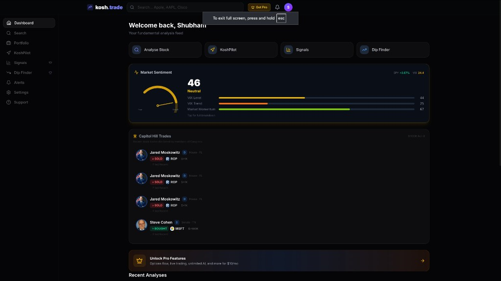
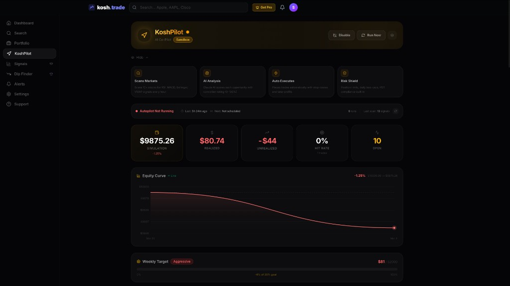
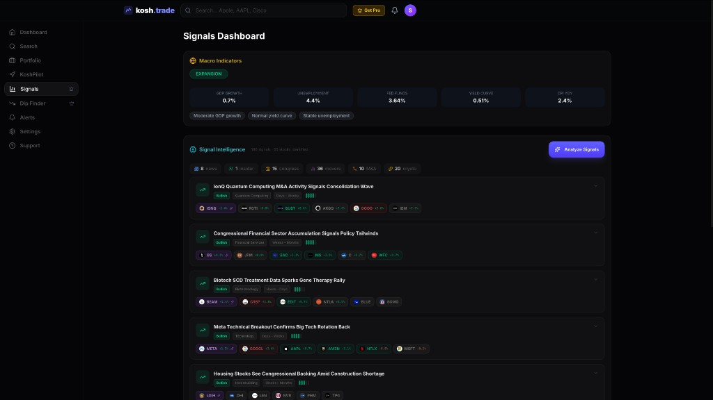

# Kosh

A self-hosted trading intelligence platform that scans markets, identifies opportunities from multiple signal sources, and executes trades autonomously based on configurable risk profiles.

Built with Next.js, PostgreSQL, and deployed on a Raspberry Pi.

**Live at [kosh.trade](https://kosh.trade)**

---

## Screenshots

<p align="center">
  
</p>

<p align="center">
  
</p>

<p align="center">
  
</p>

<p align="center">
  
</p>

---

## Architecture

```
┌─────────────────────────────────────────────────────────────────────┐
│                          kosh.trade (UI)                            │
│                                                                     │
│   ┌──────────┐  ┌──────────┐  ┌──────────┐  ┌───────────────────┐  │
│   │Dashboard │  │ Signals  │  │Portfolio │  │    KoshPilot      │  │
│   │          │  │          │  │          │  │  (Auto-Trading)   │  │
│   └────┬─────┘  └────┬─────┘  └────┬─────┘  └────────┬──────────┘  │
│        └──────────────┴─────────────┴─────────────────┘             │
│                               │                                     │
├───────────────────────────────┼─────────────────────────────────────┤
│                        API Layer (Next.js)                          │
│                               │                                     │
│   ┌───────────────────────────┼───────────────────────────────┐     │
│   │                           │                               │     │
│   │  ┌─────────────┐  ┌──────┴──────┐  ┌──────────────────┐  │     │
│   │  │  Signal      │  │  Trading    │  │  Stock Analysis  │  │     │
│   │  │  Discovery   │  │  Engine     │  │  & Research      │  │     │
│   │  └──────┬───────┘  └──────┬──────┘  └────────┬─────────┘  │     │
│   │         │                 │                   │            │     │
│   │  ┌──────┴───────┐  ┌─────┴───────┐  ┌───────┴────────┐   │     │
│   │  │  AI Analyst  │  │  Risk Mgmt  │  │  Technical     │   │     │
│   │  │  (Claude)    │  │  & Sizing   │  │  Scanner       │   │     │
│   │  └──────────────┘  └─────────────┘  └────────────────┘   │     │
│   │                                                           │     │
│   └───────────────────────────────────────────────────────────┘     │
│                               │                                     │
├───────────────────────────────┼─────────────────────────────────────┤
│                        Data Sources                                 │
│                               │                                     │
│   ┌──────────┐  ┌──────────┐  │  ┌──────────┐  ┌──────────────┐    │
│   │   FMP    │  │  Yahoo   │  │  │ Finnhub  │  │  Claude AI   │    │
│   │  API     │  │ Finance  │  │  │   API    │  │  (Anthropic) │    │
│   └──────────┘  └──────────┘  │  └──────────┘  └──────────────┘    │
│                               │                                     │
└───────────────────────────────┼─────────────────────────────────────┘
                                │
                    ┌───────────┴───────────┐
                    │   Raspberry Pi        │
                    │                       │
                    │  ┌─────────────────┐  │
                    │  │  PostgreSQL     │  │
                    │  │  (Prisma ORM)   │  │
                    │  └─────────────────┘  │
                    │  ┌─────────────────┐  │
                    │  │  PM2 + Cron     │  │
                    │  │  (Auto Cycles)  │  │
                    │  └─────────────────┘  │
                    └───────────────────────┘
```

## How It Works

**Signal Discovery** — Scans 12+ data sources every hour: market news, insider trades, congressional purchases, analyst upgrades/downgrades, M&A activity, sector performance, SEC filings, crypto markets, and market movers. Signals are aggregated and ranked by urgency.

**AI Analysis** — Claude synthesizes raw signals into market narratives, identifies affected stocks (including second-order effects), and scores each opportunity with a conviction rating.

**Technical Validation** — Every candidate runs through RSI, MACD, Bollinger Bands, VWAP, volume analysis, trend detection, and support/resistance levels before any trade is placed.

**Autonomous Execution** — Trades are placed automatically with position sizing based on risk profile, stop-losses, take-profit targets, and trailing stops. The engine also monitors open positions and exits when conditions are met.

## Features

**KoshPilot — Autonomous Trading**
- Signal-first market scanning — discovers what to trade from signals, not from a fixed list
- Risk-managed execution with three profiles: Conservative, Moderate, Aggressive
- Position add-on policy for existing holdings
- Live equity graph with real-time P&L tracking
- Autopilot health monitoring — shows cron status, last run, signals scanned
- Cron-driven on a Raspberry Pi — fully hands-off

**Signals & Research**
- Market-wide signal intelligence with AI narrative synthesis
- Best-buy recommendations across investment horizons
- Stock deep-dive with technicals, fundamentals, earnings, insider activity
- Congressional trade tracking
- Dip finder and fear/greed index

**Portfolio Management**
- Multi-portfolio tracking with holdings and performance
- AI-generated portfolio summaries
- Price alerts and notifications

## Tech Stack

| Layer | Tech |
|-------|------|
| Frontend | Next.js 16, React 19, Tailwind CSS, Recharts |
| Backend | Next.js API Routes, TypeScript |
| Database | PostgreSQL, Prisma ORM |
| AI | Claude (Anthropic SDK) |
| Market Data | FMP, Yahoo Finance, Finnhub |
| Auth | NextAuth.js, Argon2 |
| Payments | Stripe |
| Infra | Raspberry Pi, PM2, Cron |

## Setup

```bash
git clone https://github.com/shubham-balsaraf/kosh.trade.git
cd kosh.trade
npm install
cp .env.example .env   # configure your API keys
npx prisma db push
npm run dev
```

## License

Private — not open for redistribution.
